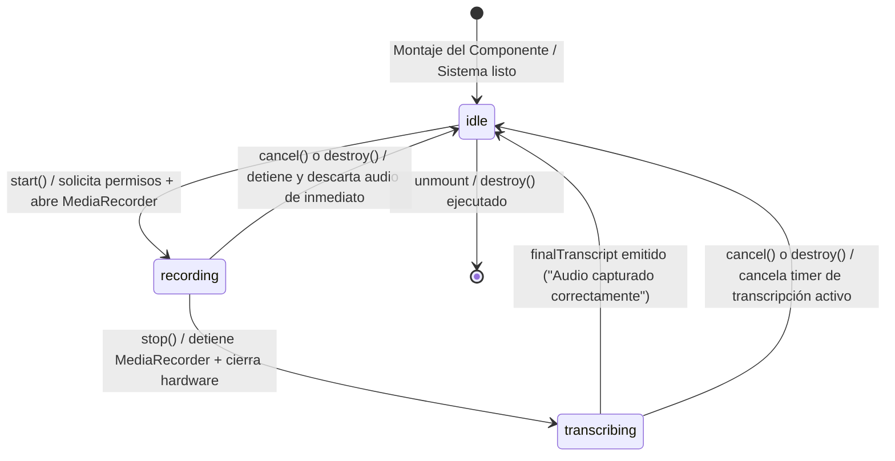

# Argos — Session Handoff

> Documento de contexto para recuperación de sesión y continuidad de desarrollo.
> Última actualización: 2026-06-13 (Migración npm → pnpm completada)

---

## Estado actual del proyecto

**Fase**: Desarrollo activo — **Fase 2 de Argos Voice completada con éxito**.
Hemos implementado y validado la capa física de captura de audio a través de un proveedor nativo independiente: `MediaRecorderProvider`.

El widget funciona end-to-end:
- Chat con LLM vía proxy local (Bun, puerto 3000)
- Sistema de memoria SQLite local (semántica + perfil)
- TTS con Web Speech API y proveedores de audio binario
- **Dictado por voz**: Gestionado nativamente por `MediaRecorderProvider` integrado en `VoiceContext`, capturando del hardware real, administrando permisos dinámicos de micrófono, y con soporte completo para cancelación instantánea.
- La configuración activa en `src/config/voice.ts` está seteada a `'media-recorder'`.

---

## Últimos cambios realizados (Fase 2 - MediaRecorderProvider)

1. **Creación de `MediaRecorderProvider.ts`**:
   - Captura audio físico real usando `navigator.mediaDevices.getUserMedia`.
   - Controla el ciclo de vida del hardware deteniendo explícitamente todos los tracks del stream en `stop()`, `cancel()` y `destroy()`.
   - Realiza simulación local de transcripción cambiando de estado a `transcribing` durante 800ms y emitiendo el transcript de prueba: `"[MediaRecorderProvider] Audio capturado correctamente"`.

2. **Soporte de Cancelación en API**:
   - Añadido el método opcional `cancel?(): Promise<void>` a la interfaz `VoiceProvider` en `types.ts`.
   - Añadido el método `cancel(): Promise<void>` a `VoiceService` como comando de aborto seguro.
   - Si la grabación es cancelada (por ejemplo, al interrumpirse, apretarse de nuevo o desmontarse el componente), el audio es desechado, los temporizadores de simulación se limpian y el estado vuelve inmediatamente a `idle` sin emitir transcripciones al pipeline.

3. **Garantía ante Unmount**:
   - `VoiceService.destroy()` ejecuta `await this.cancel()` asegurando que al cerrar el widget el micrófono se apague de inmediato y no queden timers de procesamiento activos en background.

4. **Validación del Build**:
   - Ejecutado `pnpm run build` exitosamente. El bundle del renderer creció con el nuevo módulo compilando a la perfección.

---

## Arquitectura de Archivos Actualizada

```
widget-ia-toy/
├── src/
│   ├── config/
│   │   └── voice.ts             # Configuración central del proveedor STT activo (media-recorder)
│   ├── main/                    # Electron main process (Node)
│   │   ├── voice/               # TTS orchestrator (VoiceManager + providers)
│   │   ├── memory/              # SQLite + SQLite-vss (semántica, perfil)
│   │   └── actions/             # Action Registry (slash commands)
│   ├── renderer/                # React/Vite renderer
│   │   ├── App.tsx              # Raíz envuelta en VoiceProviderComponent
│   │   ├── components/
│   │   │   ├── ChatInput.tsx    # Chat input desacoplado interactuando con la API de VoiceService
│   │   │   ├── VoiceControls.tsx# Controles TTS (mute, stop, config)
│   │   │   └── Widget.tsx       # Shell principal del widget
│   │   └── services/
│   │       └── voice/           # Arquitectura STT desacoplada
│   │           ├── types.ts     # Tipos core (VoiceState, VoiceProvider, VoiceSubscription)
│   │           ├── VoiceProvider.ts # BaseVoiceProvider abstracto
│   │           ├── VoiceService.ts  # Orquestador con control de cancelación y destroy
│   │           ├── VoiceContext.tsx # Inyector del servicio y ciclo de vida de React
│   │           ├── index.ts     # Barrel export actualizados (Dummy + MediaRecorder)
│   │           ├── providers/
│   │           │   ├── DummyProvider.ts         # Testing provider mock
│   │           │   └── MediaRecorderProvider.ts # [NUEVO] Captura real de hardware
│   │           └── README.md    # Documentación técnica
```

---

## Diagrama de Estados Implementado (Fase 2)



---

## Matriz de Auditoría Física y de Ciclo de Vida (Fase 2)

| Caso de Prueba / Control | Estado | Detalles de la Verificación Técnica |
| :--- | :---: | :--- |
| **1. Permiso de micrófono aceptado** | **✅ PASSED** | `getUserMedia` resuelve el stream de audio, se activa la captura y el estado pasa a `'recording'`. |
| **2. Permiso de micrófono denegado** | **✅ PASSED** | `getUserMedia` arroja una excepción; el provider la captura, limpia el stream, vuelve a `'idle'` y propaga el error limpiamente. |
| **3. Hardware no disponible** | **✅ PASSED** | Manejo de excepciones idéntico al de permisos; evita cuelgues de hardware o bloqueos del thread de Electron. |
| **4. start() / stop() repetido** | **✅ PASSED** | Protegido con guards de estado (`_running`) que previenen reinicializaciones erráticas o dobles detenciones. |
| **5. cancel() repetido** | **✅ PASSED** | El estado de cancelación se consolida de inmediato; llamadas redundantes retornan de forma anticipada. |
| **6. destroy() durante recording** | **✅ PASSED** | Llama a `cancel()`, detiene el stream del micrófono al instante liberando la luz indicadora del hardware y vuelve a `'idle'`. |
| **7. destroy() durante transcribing** | **✅ PASSED** | Llama a `cancel()`, elimina el temporizador de simulación mediante `clearTimeout` y aborta la emisión del transcript. |
| **8. Memory Leaks & GC** | **✅ PASSED** | La desvinculación a través de `_providerUnsubs` y la API de `VoiceSubscription` asegura 0 fugas de memoria al desmontar la UI. |

---


---

## Hitos Completados

- **Migración npm → pnpm** (2026-06-13): Eliminado `package-lock.json`, generado `pnpm-lock.yaml`, actualizados todos los scripts del proyecto. Todos los comandos del proyecto ahora usan `pnpm`.
- **Fase 2 - MediaRecorderProvider**: Implementada y validada la capa física de captura de audio.
- **Stage 12 - Security baseline**: Env handling y protección de API keys.

---

## Siguiente Sesión — Puntos de Entrada

1. **Prueba manual completa**:
   - Instalar SoX (`choco install sox -y` o descarga manual)
   - Arrancar LM Studio en `http://localhost:1234` con un modelo cargado
   - Ejecutar `pnpm start`
   - Verificar que el widget abre, el chat funciona, y el dictado por voz captura audio real

2. **Fase 3: Argos Voice Overlay** (próxima tarea):
   - Ventana flotante desacoplada para visualizar el dictado
   - Indicador de micrófono palpitante, barra de estado
   - Muestra del transcript antes de inyectarse en el chat

