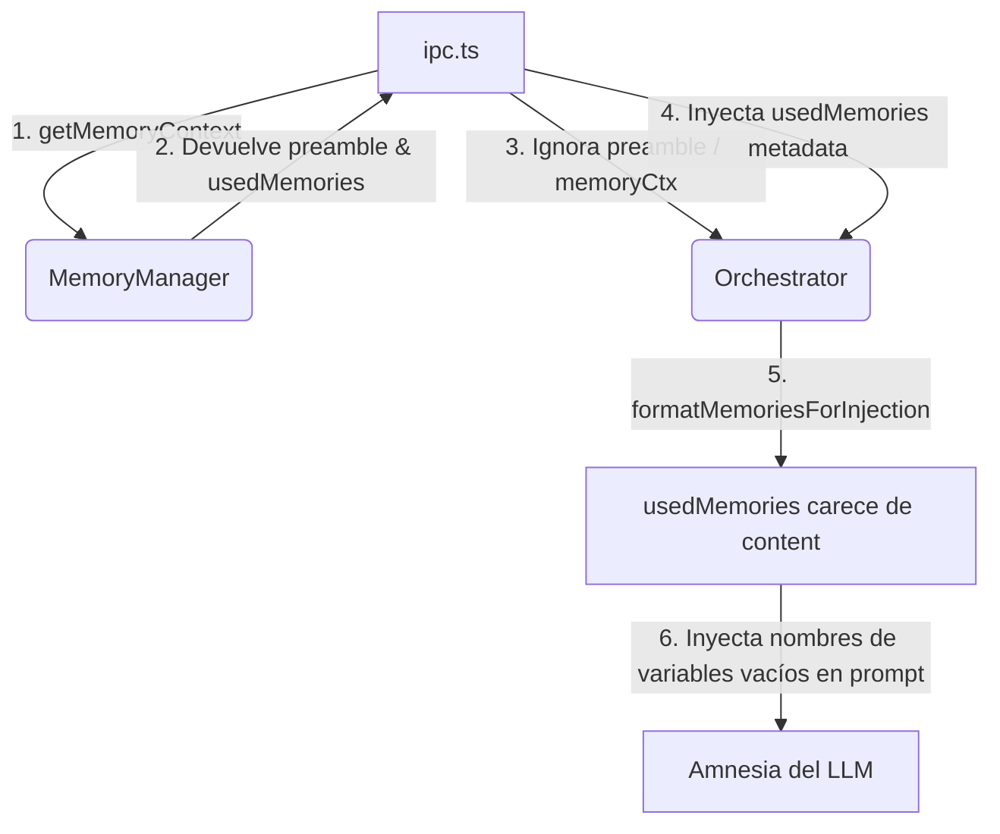

# Identity & Versioning Audit Report (SSOT)
## Project: ArgOS 3.1 Cognitive Desktop Companion

This audit report answers the critical questions regarding assistant identity propagation, memory injection architecture, and system version single source of truth (SSOT). It provides a precise plan to resolve the naming conflicts (e.g., "Atleta", "Atlas") and version mismatches.

---

## 1. Executive Summary: Identity & Versioning SSOT

### 1.1. Naming & Identity SSOT

| Parameter | Current Value | Canonical Value | SSOT Location |
| :--- | :--- | :--- | :--- |
| **Assistant Name** | `Atleta` (Stale / Corrupted) | `Argos` | `%APPDATA%\widget-ia-toy\memory\semantic\semantic.json` (`assistant.assistant_name` field) |
| **User Name** | `Nahuel` | `Nahuel` | `%APPDATA%\widget-ia-toy\memory\semantic\semantic.json` (`profile.user_name.value`) |

### 1.2. System Version SSOT

| Layer | Value | Purpose | Dependency Type |
| :--- | :--- | :--- | :--- |
| **Technical Version** | `0.1.0` | npm dependencies, Electron-builder native packaging, installer generation (`nsis`) | Hard technical dependency (CI/CD, installers) |
| **Commercial / Branding Version** | `3.1.0` | LLM metacognition, UI Display, diagnostic logs, user-facing telemetry | Soft branding / product identity |

---

## 2. Deep Dive: Answering the Core Questions

### Q1: ¿Quién es la fuente de verdad de `assistant_name`?
La **Fuente Única de Verdad (SSOT)** para `assistant_name` en el disco duro es el archivo:
```
%APPDATA%\widget-ia-toy\memory\semantic\semantic.json
```
Específicamente bajo la ruta JSON:
```json
{
  "assistant": {
    "assistant_name": "Argos"
  }
}
```
A nivel runtime, la clase `SemanticMemory` carga este archivo. El proceso `ipc.ts` lee esta propiedad y la inyecta como `assistantIdentity` al orquestador en cada turno conversacional:
```typescript
assistantIdentity: memoryManager?.getProfile()?.assistant?.assistant_name 
  ? `Tu nombre es ${memoryManager.getProfile()?.assistant?.assistant_name}.` 
  : ''
```

---

### Q2: ¿Dónde debe corregirse Atleta?
El valor `"Atleta"` (o `"Atlas"`, `"Agrax"`) se encuentra actualmente guardado en el archivo físico `semantic.json` del usuario en producción debido a inyecciones legacy no filtradas en sesiones de chat previas.

Para corregirlo de forma definitiva, se requiere:
1. **En la carga (`reconciliation.ts`):** Modificar el script de inicio de sesión (boot reconciliation) para que autodetecte si el nombre guardado en `assistant.assistant_name` pertenece a una identidad deprecada (`['atleta', 'atlas', 'agrax']`) y lo sanee forzando `"Argos"`.
2. **En la entrada del usuario (`identityLayer.ts`):** Añadir el filtro regex en `extractAssistantMutation` para evitar que el usuario (o alucinaciones del LLM) vuelvan a escribir un nombre corrupto en el archivo.
3. **En la extracción del orquestador (`promptLayerOrchestrator.ts:207`):** Corregir la expresión regular de `extractAssistantName()`. Actualmente busca `/assistant_name[:\s]*([^\n,]+)/` pero recibe `"Tu nombre es Atleta."`. Al no coincidir, devuelve `"Assistant"`, rompiendo la coherencia en el `ConversationalFocusWindow`.

---

### Q3: ¿Debe migrarse `semantic.json` o corregirse en runtime?
**Recomendación: Corrección auto-sanable en runtime (Boot Reconciliation Patch).**

Realizar una migración de base de datos manual o un script de migración destructivo es riesgoso en entornos locales. En su lugar, el sistema debe aplicar una **estrategia de auto-curación (self-healing) durante el inicio de la app**. 

Al iniciar `MemoryManager.initialize()`, el método `reconcileMemory(rawData)` en `reconciliation.ts` puede evaluar el valor cargado de `assistant.assistant_name`. Si es un nombre legacy, lo sobrescribe en el objeto de retorno con `"Argos"`, y el cargador de memoria automáticamente persistirá este cambio corregido de forma atómica en `semantic.json`.

Esto es **seguro, elegante y completamente transparente** para el usuario.

---

### Q4: ¿Existe alguna dependencia real de versionado sobre `package.json` `0.1.0`?
**Sí, técnica.**
`package.json` en su versión `"0.1.0"` tiene dependencias directas con:
1. **NPM & Node Resolution:** Configuración de dependencias locales.
2. **Electron-builder Packaging:** Genera ejecutables etiquetados internamente como `widget-ia-toy-0.1.0.exe`.
3. **Auto-updates:** Si se introduce un actualizador nativo, evaluará la versión del binario empaquetado.

> [!WARNING]
> Cambiar drásticamente la versión técnica de `0.1.0` a `3.1.0` en `package.json` podría romper builds locales, scripts de empaquetado existentes u otros flujos de CI/CD que asumen la versión inicial de desarrollo.

---

### Q5: ¿3.1 representa versión técnica o comercial?
**Representa una versión comercial y de branding del asistente.**

El sistema actual tiene dos naturalezas:
- **Core Técnico:** Versión `0.1.0` (estado de desarrollo, base técnica de Electron).
- **Capa Cognitiva/Comercial:** Versión `3.1.0` (la versión comercial del producto que el LLM debe conocer metacognitivamente).

#### Solución de Cohesión:
En lugar de modificar el `package.json` técnico, mantendremos la separación de responsabilidades:
- `package.json` continuará con su versión técnica (`0.1.0` en desarrollo, incrementada mediante semver estándar en release).
- El motor de introspección cognitiva (`runtimeIntrospection.ts`, `proxy.ts`, `SelfKnowledgeSubsystem.ts`) inyectará la versión de producto/API cognitivo comercial `3.1.0`.

Esto garantiza la coherencia metacognitiva del LLM (sabrá que es la versión 3.1) sin comprometer las dependencias de empaquetado y build de Node/Electron.

---

## 3. Additional Research: `memoryCtx` vs `usedMemories`

Durante nuestra investigación, descubrimos por qué el asistente sufría de **amnesia completa**.

### El Flujo Roto (Antes del Parche)


### El Análisis de Solución
`MemoryManager.getMemoryContext` genera dos piezas:
1. `preamble` (`memoryCtx`): Un string XML pre-armado y estructurado con toda la memoria recuperada.
2. `usedMemories`: Un array de metadatos `Array<{ type, label, score }>` sin contenido.

El orquestador (`promptLayerOrchestrator.ts`) requiere un array de objetos para priorizar y recortar memorias de acuerdo al presupuesto de tokens dinámico (pressure control). Al recibir `usedMemories` (que no tiene la propiedad `content`), la función `formatMemoriesForInjection` genera líneas vacías de contexto (ej. `- profile: user_name [relevance: 100%]`).

### Propuesta Técnica Elegante (Sin romper la Arquitectura)
La solución perfecta consiste en extender `MemoryUsedItem` en `retrieval.ts` para incluir la propiedad `content?: string` y poblarla durante la construcción del preámbulo:
```typescript
export interface MemoryUsedItem {
  type: string
  label: string
  score: number
  content?: string  // NUEVO
}
```
Esto permite que:
- El orquestador continúe realizando su control de presión y tokens dinámico sobre `usedMemories`.
- El LLM reciba la memoria completa e inyectada con su valor real, eliminando la amnesia de inmediato.
- **ZERO modificaciones** requeridas en `ipc.ts` o en los métodos de análisis del orquestador.
